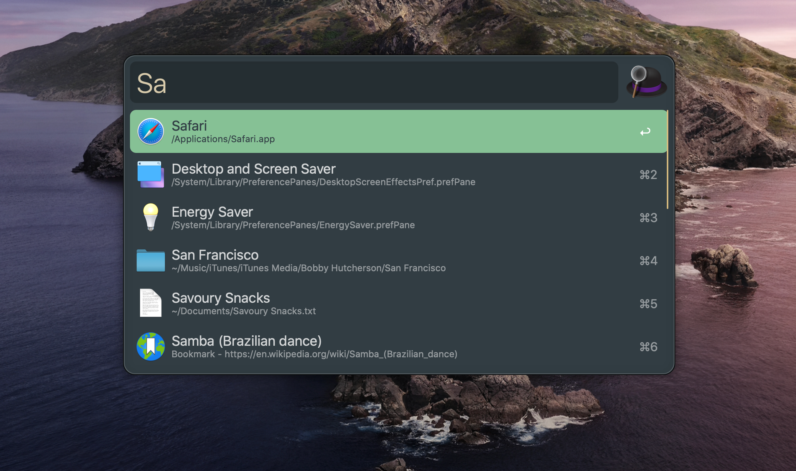

<h1 align="center">
𝐅𝐨𝐫𝐞𝐬𝐭 𝐍𝐢𝐠𝐡𝐭
</h1>

  <a href="https://github.com/mhanberg/forest-night-alfred">Repository</a> |
  <a href="https://github.com/mhanberg/forest-night-alfred/issues">Issues</a> |
  <a href="https://github.com/mhanberg/forest-night-alfred/blob/main/CHANGELOG.md">Changelog</a>
    

This color scheme is a port of [Forest Night](https://github.com/sainnhe/forest-night) for [Alfred](https://www.alfredapp.com/). 

## Features

- Green based but warm-toned.
- Designed to have soft contrast for eye protection.
- Works well with [redshift](https://github.com/jonls/redshift) and [f.lux](https://justgetflux.com).

## Install

Download and open this [file](https://raw.githubusercontent.com/mhanberg/forest-night-alfred/main/alfred/Forest%20Night.alfredappearance).

You can download the file by right clicking the page and selecting "Save As...", just make sure it saves the `alfredappearance` extension.
## Features

- Green based but warm-toned.
- Designed to have soft contrast for eye protection.
- Works well with [redshift](https://github.com/jonls/redshift) and [f.lux](https://justgetflux.com).

## Related Projects

See this [wiki page](https://github.com/sainnhe/forest-night/wiki/Related-Projects).

## License

[MIT](./LICENSE) © Mitchell Hanberg
